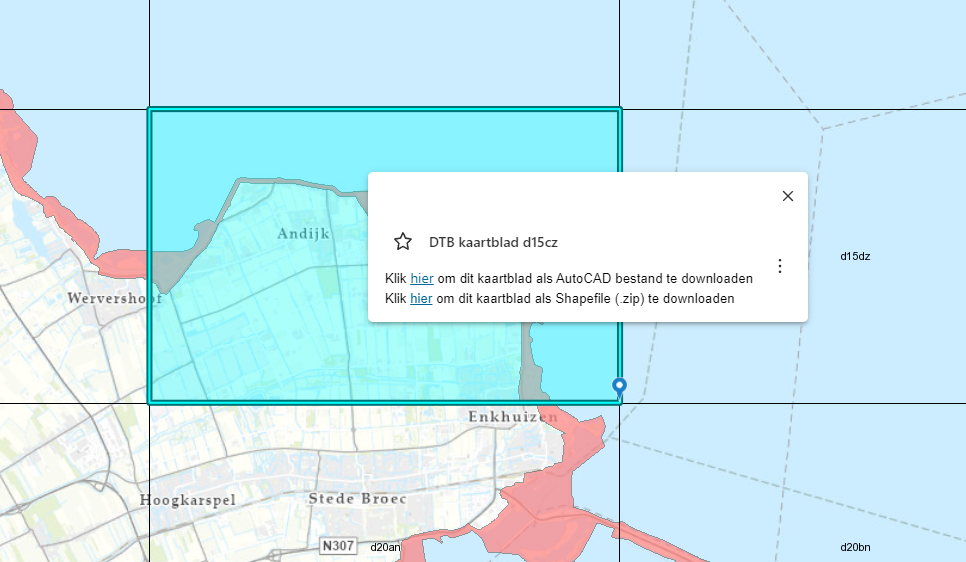
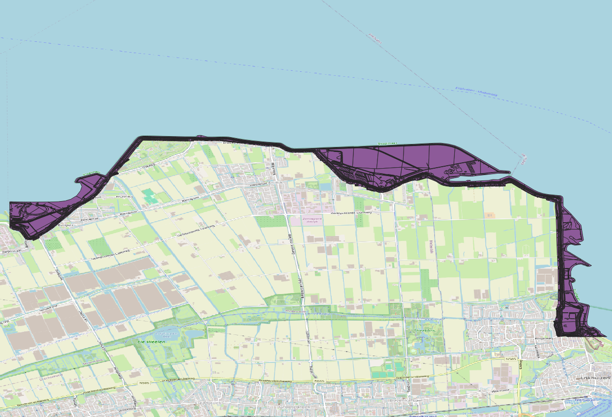
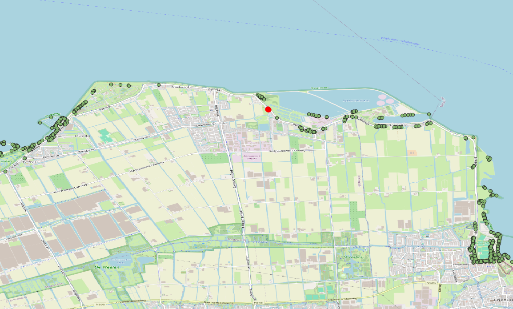
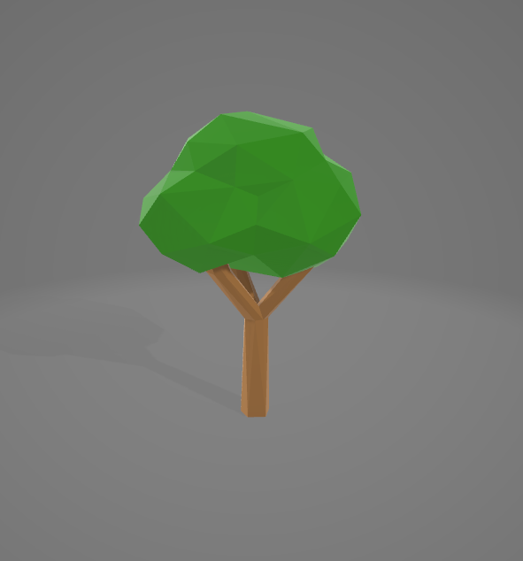

# Dataverwerking

## Inleiding

In deze opdracht gaan we 3D tilesets maken van geografische data. We gebruiken open source tools om data uit een PostgreSQL database te converteren naar 3D Tiles.

Als brondata gebruiken we het Digitaal Topografisch Bestand (DTB) van Rijkswaterstaat. Het DTB bevat topografische gegevens van Nederland in de vorm van lijnen, vlakken en punten.

Uit de DTB gebruiken we twee bestanden:

- DTB vlakken voor modellen in Batched 3D Models (b3dm) formaat;

- DTB punten voor modellen in Instanced 3D Models (i3dm) formaat.

Om de conversie voor elkaar te krijgen voeren we de volgende stappen uit: 

- DTB downloaden en importeren naar de PostgreSQL database met de PostGIS extensie; 

- Twee tabellen aanmaken die dienen als input voor pg2b3dm en i3dm.export;  

- 3D tilesets maken van de DTB vlakken en punten;
 
### Data downloaden en importeren 

Van een gebiedje bij Andijk gaan we DTB downloaden en importeren in de database.

- Zoek via de RWS DTB Bladindeling viewer (https://geoweb.rijkswaterstaat.nl/ModuleViewer/?app=1c8c833022c04e63a0f74533c19a6a27) het Andijk kaartblad (DTB kaartblad d15cz)

Klik op de link 'Klik hier om dit kaartblad als Shapefile (.zip) te downloaden' in de popup om de data (d15cz.zip) te downloaden.



De directe link is: https://downloads.rijkswaterstaatdata.nl/dtb/geogegevens/shapefile/d15cz.zip

Bekijk de inhoud van de zip file met GDAL command line tool 'ogrinfo':

```shell
C:\workshop_3dtiles> ogrinfo /vsizip/d15cz.zip
INFO: Open of `/vsizip/d15cz.zip'
      using driver `ESRI Shapefile' successful.
1: d15cz_lin (3D Line String)
2: d15cz_reg (3D Polygon)
3: d15cz_sym (3D Point)
```

De zip bevat 3 shapefiles:

- d15cz_lin.shp (DTB lijnen)
- d15cz_reg.shp (DTB vlakken)
- d15cz_sym.shp (DTB punten)

 Voor het laden van de data in PostGIS gebruiken we GDAL commandline tool ogr2ogr. 

Voor het laden van de DTB vlakken in de database voer het volgende commando uit:

```shell
 C:\workshop_3dtiles> ogr2ogr -f "PostgreSQL" PG:"host=localhost port=5439 user=postgres dbname=postgres password=postgres" /vsizip/d15cz.zip/d15cz_reg.shp -t_srs epsg:4979 -nln public.dtb_vlak_andijk -nlt MULTIPOLYGONZ
 ```

Voor het laden van de DTB punten in de database voer het volgende commando uit:

```shell
 C:\workshop_3dtiles> ogr2ogr -f "PostgreSQL" PG:"host=localhost port=5439 user=postgres dbname=postgres password=postgres" /vsizip/d15cz.zip/d15cz_sym.shp -t_srs epsg:4979 -nln public.dtb_punt_andijk -nlt POINTZ
```

Controleer of de data goed geladen is in de database:

```sql
SELECT count(*) from public.dtb_punt_andijk;
SELECT count(*) from public.dtb_vlak_andijk;
``` 

Voorbeeld met psql client:

```shell
C:\workshop_3dtiles> psql -h localhost -p 5439 -U postgres -d postgres -c "SELECT count(*) from public.dtb_punt_andijk;SELECT count(*) from public.dtb_vlak_andijk;"
Password for user postgres:

 count
-------
  7659
(1 row)


 count
-------
  4685
(1 row)
```

Vraag de vlakken op in QGIS:



### Data voorbereiden

Om de data te kunnen converteren naar 3D Tiles moeten we tabellen aanmaken die dienen als input voor 3D Tilers pg2b3dm (vlakken) en i3dm.export (punten).

Maak eerst ruimtelijke indexen zodat queries sneller uitgevoerd worden:

```sql
CREATE INDEX ON public.dtb_vlak_andijk USING gist(st_centroid(st_envelope(wkb_geometry)));
CREATE INDEX ON public.dtb_punt_andijk USING GIST (wkb_geometry);
```

Voor de punten maken we een database view aan die de attributen van de punten bevat.

```sql
CREATE or replace view public.v_dtb_punt_andijk AS
SELECT
RANDOM()*360 AS rotation,
(RANDOM()*1.5)+0.5 AS scale,
json_build_array(json_build_object('dtb id',dtb_id),
 json_build_object('omschrijving',omschr),
 json_build_object('datum',datum)) AS tags,
'tree.glb' AS model,
wkb_geometry AS geom
FROM public.dtb_punt_andijk
WHERE omschr = 'Boom';
```

De database view is gebaseerd op DTB punten en bevat de volgende gegevens:

- we selecteren alleen de bomen;

- gebruiken een random rotatie en schaal;

- voegen het te gebruiken model model (tree.glb) toe;

- voegen de attributen 'dtb id', 'omschrijving' en 'datum' toe in de 'tags' kolom.

Vraag de database view public.v_dtb_punt_andijk in QGIS op:



### 3D Tiles maken van DTB vlakken

De volgende stappen laten zien hoe we Batched 3D Models kunnen maken van de DTB vlakken.

- Download command line tool pg2b3dm (https://github.com/Geodan/pg2b3dm/releases, voor Windows kies pg2b3dm-win-x64.zip
) en pak het zip-bestand uit en kopieer de executable naar de workdirectory.

- Open een command prompt in de werkdirectory

Check de versie van pg2b3dm

```shell
C:\workshop_3dtiles> pg2b3dm --version
```

Resultaat:

```
Tool: pg2b3dm 2.18.1.0
```

- Voer het volgende commando uit

```
C:\workshop_3dtiles>  pg2b3dm -U postgres -h localhost -p 5439 -d postgres -t public.dtb_vlak_andijk -a dtb_id,omschr,datum --use_implicit_tiling false -o ./dtb_vlakken -c wkb_geometry --create_gltf false
```

Resultaat:

```
Tool: pg2b3dm 2.18.1.0
Options: -U postgres -h localhost -p 5439 -d postgres -t public.dtb_vlak_andijk -a dtb_id,omschr,datum --use_implicit_tiling false -o ./dtb_vlakken -c wkb_geometry --create_gltf false
Password for user postgres:
Start processing 2024-10-24T14:53:47....
Input table: public.dtb_vlak_andijk
Input geometry column: wkb_geometry
App mode: Cesium
Spatial reference of public.dtb_vlak_andijk.wkb_geometry: 4979
Spatial index detected on public.dtb_vlak_andijk.wkb_geometry
Skip create tiles: False
Query bounding box of public.dtb_vlak_andijk.wkb_geometry...
Bounding box for public.dtb_vlak_andijk.wkb_geometry (in WGS84): 5.16509253, 52.71234743, 5.29261079, 52.75545464
Height values: [37.44 m - 74.79 m]
Default color: #FFFFFF
Default metallic roughness: #008000
Doublesided: True
Default AlphaMode: OPAQUE
Create glTF tiles: False
Attribute columns: dtb_id,omschr,datum
Center (wgs84): 5.228851660450694, 52.733901034211115
Starting Cesium mode...
Translation ECEF: 3854182.25,352715.03125,5052667.5
3D Tiles version: 1.0
Lod column:
Radius column:
Geometric error: 2000
Geometric error factor: 2
Refinement: ADD
Add outlines: False
Use 3D Tiles 1.1 implicit tiling: False
Maximum features per tile: 1000
Start generating tiles...
Creating tile: 2_3_3.b3dm
Tiles created: 10

External tileset.json files: 0
Writing root tileset.json...

Time: 0h 0m 1s 759ms
Program finished 2024-10-24T14:53:49.
```

Uitleg commando:

-U: gebruikersnaam van de database

-h: hostnaam van de database

-p: poortnummer van de database

-t: naam van de tabel

-a: attributen van de tabel

--use_implicit_tiling false: gebruik geen 3D Tiles 1.1 implicit tiling 

--create_gltf: maak 3D Tiles 1.0 b3dm files aan ipv 3D Tiles 1.1 glb files 

-o: output directory

-c: kolom met geometrie

Na het opgeven van het wachtwoord wordt de 3D tileset gemaakt in de directory 'dtb_vlakken'.

De directory 'dtb_vlakken' bevat:

- een tileset.json bestand. 

In dit bestand staan de referenties naar de 3D tiles.

- een directory 'content' met de 3D tiles in b3dm formaat. 

### 3D Tiles maken van DTB punten

Voor het maken van Instanced 3D Models van de DTB punten gebruiken we i3dm.export.

- Download command line tool i3dm.export (https://github.com/Geodan/i3dm.export/releases)

- Unzip het bestand en kopieer i3dm.export.exe naar de werkdirectory

Check:

```shell
C:\workshop_3dtiles> i3dm.export --version
i3dm.export 2.9.0
```

- kopieer het boom model [tree.glb](./tree.glb) uit de 3D Tiles workshop repository naar de werkdirectory;

- bekijk het 3D model van de boom in '3D Viewer' of online https://gltf-viewer.donmccurdy.com/



- Voer het volgende commando uit

```shell
C:\workshop_3dtiles> i3dm.export -c "Host=localhost;Username=postgres;Password=postgres;Database=postgres;Port=5439" -t public.v_dtb_punt_andijk -o ./dtb_punten --use_i3dm true
```

Resultaat:

```
Tool: I3dm.export
Version: 2.9.0.0
Exporting instances from public.v_dtb_punt_andijk...
Use GPU instancing: False
Bounding box for table (WGS84): 5.1525, 52.7082, 5.3052, 52.7591
Vertical for table (meters): 37.76394842845641, 57.81986477012036
Spatial reference of public.v_dtb_punt_andijk.geom: 4979
Maximum instances per tile: 1000
Start generating tiles...
Creating tile: ./dtb_punten/content/0_0_0.i3dm
Tiles written: 1
Subtree files written: 1
SubtreeLevels: 2
SubdivisionScheme: QUADTREE
Refine method: ADD
Geometric error: 1000
Writing ./dtb_punten/tileset.json...
Time: 0h 0m 0s 434ms
End of process
```

Uitleg commando:

-c: connectiestring naar de database

-t: naam van de tabel of view

-o: output directory

--use_i3dm: gebruik 3D Tiles 1.0 i3dm formaat

Na het opgeven van het wachtwoord wordt de Instanced 3D tileset gemaakt in de directory 'dtb_punten'. De directory bevat: 

- een tileset.json bestand;

- een directory 'content' met de 3D tiles in I3dm formaat;

- een subtree folder met subtree file.

## Valideren tilesets

De 3D tilesets kunnen gevalideerd worden met de tool 3D Tiles Validator - https://github.com/CesiumGS/3d-tiles-validator

Voor installatie van deze tool is Node.js vereist.

- Open een command prompt en installeer de 3D Tiles Validator en controleer de versie.

```shell
C:\workshop_3dtiles> npm install -g 3d-tiles-validator
3d-tiles-validator --version
0.5.0
```

- Valideer de tilesets

Voor de vlakken:


```shell
C:\workshop_3dtiles> 3d-tiles-validator --tilesetFile ./dtb_vlakken/tileset.json
Validating tileset ./dtb_vlakken/tileset.json
Validation result:
{
  "date": "2024-08-26T13:00:03.503Z",
  "numErrors": 0,
  "numWarnings": 0,
  "numInfos": 0
}
```

Er zijn geen errors, warnings of informatie meldingen. De 3D tileset is valide.

Voor de punten:
  
```shell
C:\workshop_3dtiles> 3d-tiles-validator --tilesetFile ./dtb_punten/tileset.json
```

Resultaat:

```
Validating tileset ./dtb_punten/tileset.json
Validation result:
{
  "date": "2024-08-13T13:11:54.633Z",
  "numErrors": 0,
  "numWarnings": 0,
  "numInfos": 1,
```
Ook hier geen errors maar wel Informatie meldingen. Deze meldingen gaan over het gebruikte model (tree.glb) dat volgens glTF niet valide is. We kunnen het model valideren in https://github.khronos.org/glTF-Validator/ , dan verschijnen dezelfde meldingen. 

Het beste is om met valide modellen te werken maar voor nu negeren we de meldingen. 

Conclusie van de validatie: de 3D tilesets zijn valide, maar er zijn meldingen over het gebruikte model 'tree.glb'.

## Comprimeren tilesets

De 3D tilesets kunnen gecomprimeerd worden met de tool 3D Tiles Compressor. De 3D Tiles worden dan kleiner en ophalen/visualiseren gaat sneller

Voor het comprimeren van de DTB vlakken voer het volgende commanda uit:

Controleer voor het comprimeren de benodigde opslagruimte voor folder 'dtb_vlakken'

```shell
C:\workshop_3dtiles> docker run -v c:\workshop_3dtiles\dtb_vlakken\content:/tiles -it geodan/compressor5000
```

Controleer na het comprimeren opnieuw de benodigde opslagruimte voor folder 'dtb_vlakken'

Vraag: Hoeveel keer is de dataset kleiner geworden?

Vraag: Waarom comprimeren we alleen de vlakken en niet de punten?

## Facultatieve opdracht

- Maak een 3D Tileset van panden in Andijk. Gebruik hiervoor BAG data (in Geopackage formaat), te downloaden via de 3D Bag website (https://3dbag.nl/en/download). Zorg ervoor dat de attribuut 'identificatie' wordt meegenomen in de 3D tileset.

Comprimeer de 3D tileset met de 3D Tiles Compressor.

Zie eventueel bestand [./resultaten/1_dataverwerking.txt](./resultaten/1_dataverwerking.txt) voor een uitwerking van deze opdracht.

Ga door naar [2_datavisualisatie.md](2_datavisualisatie.md)
