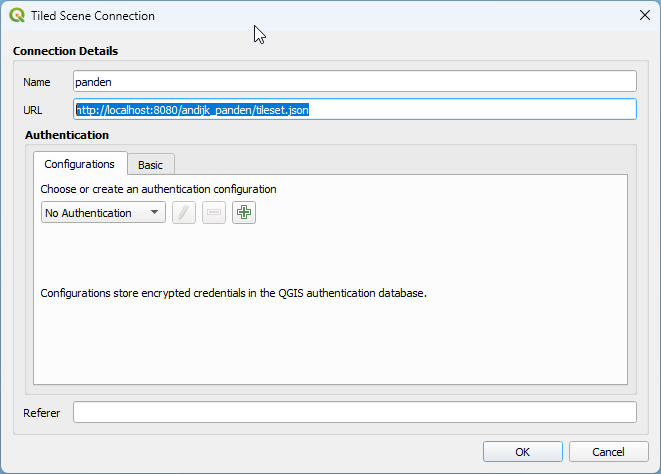
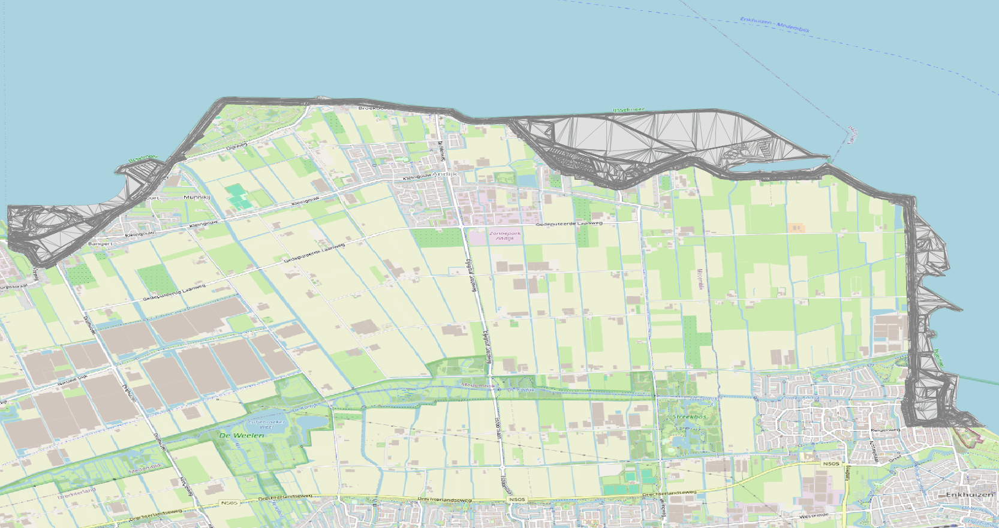
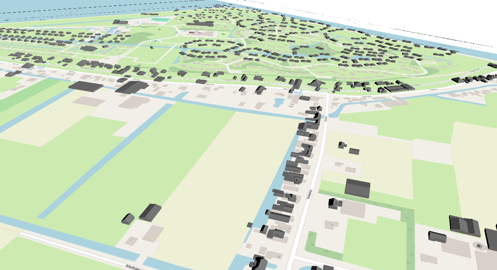

# 2. Data visualisatie

In deze module gaan we aan de slag met het visualiseren van de 3D Tiles die we in de vorige module hebben gemaakt. We gaan de 3D Tiles inladen in een CesiumJS webomgeving en de tileset stijlen aanpassen. Daarnaast voegen we 3D modellen toe aan de visualisatie.

## Server opzetten

We beginnen met het installeren van een webserver om de 3D Tiles te serveren. We gebruiken hiervoor Node.JS tool 'http-server'.

```shell
C:\workshop_3dtiles> npm install -g http-server
``` 

Open de command line en navigeer naar werkdirectory. Start de server met het volgende commando:

```shell
C:\workshop_3dtiles> http-server
Starting up http-server, serving ./

http-server version: 14.1.1

http-server settings:
CORS: disabled
Cache: 3600 seconds
Connection Timeout: 120 seconds
Directory Listings: visible
AutoIndex: visible
Serve GZIP Files: false
Serve Brotli Files: false
Default File Extension: none

Available on:
  http://192.168.178.60:8080
  http://127.0.0.1:8080
  http://172.24.32.1:8080
Hit CTRL-C to stop the server
```

Open een webbrowser en ga naar [http://localhost:8080](http://localhost:8080). Bestanden in de werkdirectory worden nu getoond.

## Cesium Viewer

Voor het inladen van de 3D Tiles in een CesiumJS-webomgeving, maken we gebruik van de Cesium Viewer.

Kopieer bestand [index.html](./index.html) uit de 3D Tiles workshop repository naar de werkdirectory.

Open index.html in een teksteditor. In de code worden 3 tilesets geladen:

-  DTB Vlakken: ./dtb_vlakken/tileset.json

-  DTB puntent: ./dtb_punten/tileset.json

Open een brower en ga naar [http://localhost:8080/index.html](http://localhost:8080/index.html). 3D Tiles worden nu getoond in de Cesium Viewer.

De Cesium viewer bevat een aantal kaartlagen:

- PDOK BRT achtergrondkaart;

- 3D Basisvoorziening - Digitaal Terreinmodel (DTM)

https://api.pdok.nl/kadaster/3d-basisvoorziening/ogc/v1_0/collections/digitaalterreinmodel

Inspecteer de viewer op de DTB vlakken, bomen en panden. Welke attributen zijn er beschikbaar per laag?

Oefening: Voeg de Andijk 3D Bag panden toe aan de viewer

Zie eventueel bestand [./resultaten/2_datavisualisatie.txt](./resultaten/2_datavisualisatie.txt) voor een uitwerking van deze opdracht.

## Tileset stijlen aanpassen

Styling kan worden toegepast op de tileset op twee manieren:

- tijdens het genereren van de tileset

- via de index.html file

In deze oefening wordt de styling toegepast via de index.html file.

Zie voor een beschrijving van de 3D Tiles Styling language https://github.com/CesiumGS/3d-tiles/tree/main/specification/Styling

Open index.html in een teksteditor. Voeg de volgende code toe aan de tileset van de DTB vlakken 
op de plek van '// todo: voeg hier code toe':

```javascript
    tilesetDtbVlakken.style = new Cesium.Cesium3DTileStyle({
      color: {
        conditions: [
        ["${feature['osmchr']} === 'Bitumen'", "color('#430719')"],
        ["${feature['omschr']} === 'Steen bekleding'", "color('#740320')"],
        ["${feature['omschr']} === 'Bomen en struiken'", "color('#008000')"],
        ["${feature['omschr']} === 'Industrieterrein'", "color('#FFFF00')"]
        // todo: add more conditions
        ]
      }
    });
```

Bekijk het resultaat in de Cesium Viewer. De vlakken zijn nu gekleurd op basis van de omschrijving van de vlakken. 

Opdracht: maak features waar omschr === 'Meer' blauw.

## 3D modellen toevoegen

Naast 3D Tiles kunnen we ook losse 3D modellen toevoegen aan de visualisatie.

Kopieer het 3D model [windturbine.glb](./windturbine.glb) uit de 3D Tiles workshop repository naar de werkdirectory.

Bekijk het model in 3D Viewer:


De glTF bevat ook een animatie voor de wieken.

Voeg de volgende code toe aan index.html en bekijk het resultaat in de browser:

```javascript
    const windturbine = viewer.entities.add({ 
      position: Cesium.Cartesian3.fromDegrees(5.193486,52.754867), 
      model: { 
        uri: "windturbine.glb"         
     }, 
    });
```

Laad de viewer, er wordt een windturbine met animatie getoond in de Cesium Viewer.


## 3D Basisvoorziening

In de 3D Basis voorziening van PDOK zijn een aantal landelijke 3D Tilesets beschikbaar die we kunnen inladen in de Cesium Viewer.

Zie https://api.pdok.nl/kadaster/3d-basisvoorziening/ogc/v1_0/collections/gebouwen voor een beschrijving van de 3D gebouwen 
tileset. 

Voeg deze tileset toe aan de Cesium Viewer en inspecteer de gebouwen.

```javascript
const tileset3DGebouwen = await Cesium.Cesium3DTileset.fromUrl(
  "https://api.pdok.nl/kadaster/3d-basisvoorziening/ogc/v1_0/collections/gebouwen/3dtiles"
);  
viewer.scene.primitives.add(tileset3DGebouwen);
```

## QGIS

In deze oefening gaan we de gemaakte 3D BAG panden 3D Tiles inladen in QGIS.

Open QGIS en ga naar de menu optie 'Layer' -> 'Data Source Manager' en selecteer 'Scene'.

Voeg de 3D BAG panden toe via 

- Zet 'Source Type' op 'Service'

Maak een nieuwe connectie aan via knop 'New' -> 'New Cesium 3D Tiles Connection'

Name: panden

URL: http://localhost:8080/andijk_panden/tileset.json



Klik op Add, 3D BAG panden worden getoond in QGIS.



Vraag: Waarom bestaan alle panden uit driehoeken?

Voor het bekijken in 3D in QGIS, ga naar View -> 3D Map Views ->  new 3D Map View

Als het goed is opent er een nieuw venster met de 3D Tiles.



Wat valt er op aan de 3D View in QGIS?


