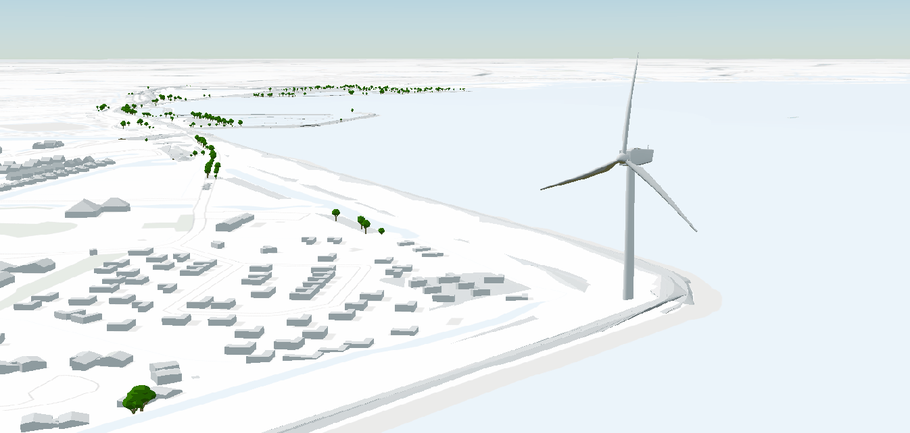

# 2 - Data visualisatie

In this module, we will work on visualizing the 3D Tiles we created in the previous module. We will load the 3D Tiles into a CesiumJS web environment and adjust the tileset styles. In addition, we will add 3D models to the visualization.

## Setting up a server

We start by installing a web server to serve the 3D Tiles. We will use the Node.JS tool 'http-server'.

```shell
npm install -g http-server
```

Open the command line and navigate to the working directory. Start the server with the following command:

```shell
http-server
```

Or, if you are using Python:

```shell
python -m http.server 8080
```

Open a web browser and go to [http://localhost:8080](http://localhost:8080). You will see the Cesium 3D viewer.

## Cesium Viewer

To load the 3D Tiles into a CesiumJS web environment, we will use the Cesium Viewer.

Open index.html. This webpage will initialize Cesium and load the 3D Tiles we created. 

The Cesium viewer also loads a background map from PDOK and a Digital Terrain Model (DTM).

Inspect the Cesium viewer on the DTB areas, trees, and buildings. What attributes are available per layer?

We can see that the DTB polygons sometimes disappear under the terrain. This can be solved by slightly raising the polygons with the following JS code:
  
```js
var translation = new Cesium.Cartesian3(0, 0, 5); 
var modelMatrix = Cesium.Matrix4.fromTranslation(translation);
tilesetDtbVlakken.modelMatrix = modelMatrix;
 ```

## Modify Tileset styles

Styling can be applied to the tileset in two ways:

- during the generation of the tileset

- via the index.html file

In this exercise, the styling is applied via the index.html file.

For a description of the 3D Tiles Styling language, see the [Styling Documentation](https://github.com/CesiumGS/3d-tiles/tree/main/specification/Styling).

Add the following code to the tileset of the DTB areas in index.html:

```javascript
tilesetDtbVlakken.style = new Cesium.Cesium3DTileStyle({
  color: {
    conditions: [
      ["${feature['osmchr']} === 'Bitumen'", "color('#430719')"],
      ["${feature['omschr']} === 'Steen bekleding'", "color('#740320')"],
      ["${feature['omschr']} === 'Bomen en struiken'", "color('#008000')"],
      ["${feature['omschr']} === 'Industrieterrein'", "color('#FFFF00')"]
    ]
  }
);
```

Inspect the result in the Cesium viewer. The polygons are now colored based on the description of the polygons.

Experiment with colors and add more conditions.

## Adding 3D models

In addition to the 3D tiles, we can also add individual 3D models to the visualization.

We have a 3D model called `windturbine.glb` in the working directory.

Add the following code to index.html and watch the result in the browser: 


```javascript
    const windturbine = viewer.entities.add({ 
      position: Cesium.Cartesian3.fromDegrees(5.193486,52.754867), 
      model: { 
        uri: "windturbine.glb"         
     }, 
    });
```

An animated windturbine will be shown on the map.



## Buildings

The 3D Basisvoorziening by PDOK contains a number of national 3D Tilesets that we can load into the Cesium Viewer.

See https://api.pdok.nl/kadaster/3d-basisvoorziening/ogc/v1_0/collections/gebouwen for a description of the 3D buildings tileset.

Add this tileset to the Cesium Viewer and inspect the buildings.

```javascript
const tileset3DGebouwen = await Cesium.Cesium3DTileset.fromUrl(
  "https://api.pdok.nl/kadaster/3d-basisvoorziening/ogc/v1_0/collections/gebouwen/3dtiles"
);
```

## QGIS

In this exercise, we will load the 3D Tiles into QGIS.

Open QGIS and head to the menu option 'Layer' -> 'Data Source Manager' and select 'Scene'.

- Set the  'Source Type' to 'Service'

Add a new connection with the button 'New' -> 'New Cesium 3D Tiles Connection'

Name: DTB Vlakken

URL: http://localhost:8080/dtb_vlakken/tileset.json

Click 'Add'.

Question: Why don't we see the defined styles in QGIS?

Extra assignment: Add the Andijk buildings to QGIS.

For viewing in 3D in QGIS, head to View -> 3D Map Views -> new 3D Map View. 
A new window should open with the 3D Tiles.

What do you notice about the 3D View in QGIS?


