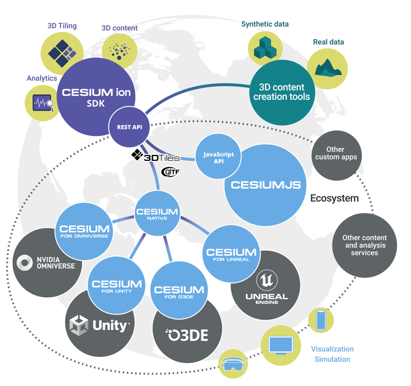

# Introduction

Digital Twins bring data from various sources together truthfully in a digital copy of the physical reality. The concept of a digital twin is very broad. In this workshop, we focus on digital twins of the physical living environment. Here, a realistic image of an area or region is provided, where spatial data is displayed clearly and can be used for many applications. Such a digital twin cannot do without the 3D component. However, most data is not directly available as 3D. Therefore, the data often needs to be processed first. These processing steps can vary greatly depending on the type of source data.

## Workshop

In this workshop, we demonstrate how this data processing works using several examples. The focus is on the 3D Tiles specification. This OGC standard helps optimize the display of large 3D datasets by smartly loading only the necessary data.

For a detailed overview of the 3D Tiles specification, see [https://github.com/CesiumGS/3d-tiles/blob/main/3d-tiles-reference-card.pdf](https://github.com/CesiumGS/3d-tiles/blob/main/3d-tiles-reference-card.pdf).

The amount of data in a digital twin is often enormous, making it undesirable to request all available data at once with performance in mind.

After data processing, we will visualize the 3D Tiles. 3D Tiles can be used by multiple applications. In this case, we use Cesium, a powerful open-source JavaScript library.

In addition to visualization in Cesium, the created tilesets are loaded into QGIS.



In this workshop, we will set up a digital twin for the Proefpolderdijk near Andijk. Managing this dike involves a lot of different data. We will work with the Digital Topographic File (DTB) of RWS. Using this data, we will show the steps needed to go from the available source data to a 3D web environment using open-source tools and open standards.

The workshop is divided into two modules:

**Part 1: Data Processing to 3D Tiles**
- Download and import data;
- Prepare data;
- Create 3D Tiles;

[1 - Data Processing](1_dataprocessing.md)

**Part 2: Data Visualization in 3D**
- Load 3D tilesets;
- Adjust tileset style;
- Add 3D models;
- Use PDOK 3D Basic Provision 3D Tiles;
- Load 3D Tiles in QGIS;

[2 - Data Visualisation](2_datavisualisation.md)

## Learning Objectives

After completing this course:

- You will have knowledge of the 3D Tiles standard;
- You will have insight into the software and techniques needed to create 3D tilesets;
- You will be able to load a 3D tileset into a CesiumJS web environment;
- You will be familiar with the possibilities for data visualization with CesiumJS.

## Requirements

- Laptop
- Internet connection
- Web browser

Required software:

- Docker
    - Check: `docker --version`
- QGIS
    -  Set the path to QGIS in the environment variables so we can use GDAL command line tools.

        Example directory: `C:\Program Files\QGIS 3.36.1\bin`

        This can be done via Control Panel - System - Edit the system Environment Variables - Environment Variables... - System Variables - Path or via the command line:

        ```shell
        set PATH=%PATH%;D:\Program Files\QGIS 3.36.1\bin
        ```

        Check: `ogr2ogr --version`
- Database management tool
    - E.g. [pgAdmin](https://www.pgadmin.org/) or [DBeaver](https://dbeaver.io/)
    - Command line enthusiasts can also use psql. psql.exe is typically located in the bin directory of the QGIS installation.
- Node.JS or Python (for setting up a quick HTTP server)
    - Download and install [Node.js](https://nodejs.org/en/download/)

In the workshop, the operating system used is Windows, but with minor adjustments, other operating systems can also be used.

## Creating a database with docker

We use Docker to start the PostGIS database. Open a terminal and execute the following command:

```
docker run -d -e POSTGRES_PASSWORD=postgres -d -p 5439:5432 postgis/postgis
```

*Command explanation*

Docker run: starts a new container.

With **-e** environment settings, such as a password or username.

With **-d** ensures that Docker runs 'detached', so it does not block the terminal but runs in the background.

With **-p** provides port mapping, we use port 5439.

*Connect to the database*

In DBeaver or PGAdmin and in QGIS, a connection can be made to the database by adding a connection. In the settings, use:

- Host: localhost
- Port: 5439
- Username: postgres
- Password: postgres

Check: Request the PostGIS version with the following SQL query:

```sql
SELECT postgis_full_version();
```

Example with psql client:

```shell
psql -h localhost -p 5439 -U postgres -d postgres -c "SELECT postgis_full_version();"

>>> POSTGIS="3.4.0 0874ea3"
```

# Work Directory

Create a work directory where files from this workshop will be stored.

For example:

```shell
cd c:\
mkdir workshop_3dtiles
```

## Data Files

In the workshop, we will use the following data files:

- Digital Topographic File (DTB) from RWS
- Bag 3D

The assignments explain how to retrieve these data files. The data files can also be found in the 'data' folder in this repository.

## Results
See the results of this workshop in the 'results' folder.

This folder contains the following subfolders:

- andijk_buildings: 3D Tiles of the buildings in Andijk
- dtb_points: 3D Tiles of the DTB points
- dtb_surfaces: 3D Tiles of the DTB surfaces

The result of the workshop is a 3D web environment in which the 3D tilesets in Andijk are loaded.

## Continue the workshop
Proceed to [1 - Data Processing](1_dataprocessing.md)


